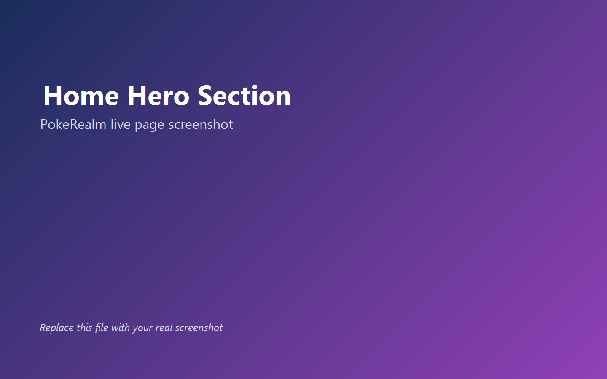
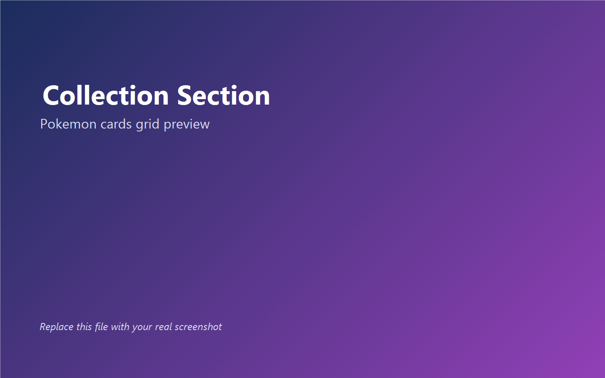

# PokeRealm

PokeRealm is a colorful Pokemon web app built with React.

Live website: https://poke-realm-beryl.vercel.app/

## What This App Does

- Shows a featured Pokemon in the hero section
- Lets you search Pokemon by name
- Lets you filter by type and habitat
- Shows a collection grid of Pokemon cards
- Supports account login and captured Pokemon tracking
- Supports export options (CSV and JSON)
- Includes simple navigation controls and smooth scrolling

## Screenshots

The screenshots below are ready in the project.  
You can replace these image files later with your real website screenshots.





## Tech Stack

- React 18
- React Router
- Styled Components
- Context API
- SignalR (for live capture updates)
- PokeAPI + custom backend API

## Project Structure

```text
src/
  components/
  contexts/
  pages/
  router/
  scenes/
  services/
public/
docs/
  screenshots/
```

## Clone And Run (Kid-Friendly Steps)

1. Install Node.js (LTS) from https://nodejs.org/
2. Open terminal
3. Run:

```bash
git clone https://github.com/Anilkumarputta/PokeRealm.git
cd PokeRealm
npm install
npm start
```

4. Open your browser at `http://localhost:3000`

## Build For Production

```bash
npm run build
```

This creates a `build` folder (the production-ready app).

## Deploy To Vercel (Very Simple)

1. Push your latest code to GitHub.
2. Go to https://vercel.com and log in.
3. Click `Add New Project`.
4. Import your `PokeRealm` GitHub repo.
5. Vercel usually detects settings automatically.
6. If needed, set:
- Build Command: `npm run build`
- Output Directory: `build`
7. Click `Deploy`.

## Important Vercel Fix (For Blank Page Issue)

This project uses SPA routing, so keep this file:

`vercel.json`

```json
{
  "rewrites": [
    {
      "source": "/(.*)",
      "destination": "/index.html"
    }
  ]
}
```

If you see a blank page after deploy:

1. Check `vercel.json` is exactly as above.
2. Redeploy from Vercel dashboard.
3. If still broken, clear build cache and redeploy.

## How To Replace Screenshots

Replace these files with your own images (keep same names):

- `docs/screenshots/01-home-hero.png`
- `docs/screenshots/02-filters.png`
- `docs/screenshots/03-collection.png`

## Available Scripts

- `npm start` - run locally
- `npm run build` - production build
- `npm test` - run tests

## Author

Anil Kumar

- LinkedIn: https://linkedin.com/in/anil-putta
- GitHub: https://github.com/Anilkumarputta

## License

This project is licensed under the MIT License.  
See `LICENSE`.
